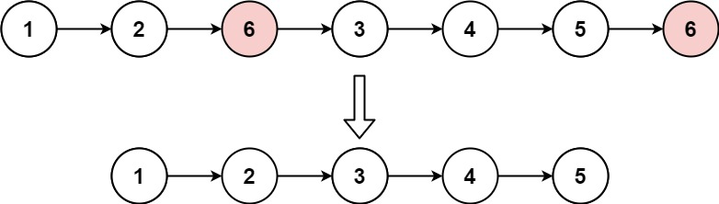

# Problem Statement

Given the head of a linked list and an integer val, remove all the nodes of the linked list that has Node.val == val, and return the new head.

### Example 1: (see image below)
  
Input: head = [1,2,6,3,4,5,6], val = 6
Output: [1,2,3,4,5]

### Example 2:

Input: head = [], val = 1
Output: []

Example 3:

Input: head = [7,7,7,7], val = 7
Output: []

```js
/**
 * Definition for singly-linked list.
 * function ListNode(val, next) {
 *     this.val = (val===undefined ? 0 : val)
 *     this.next = (next===undefined ? null : next)
 * }
 */
/**
 * @param {ListNode} head
 * @param {number} val
 * @return {ListNode}
 */
var removeElements = function(head, val) {
    
};
```

# Additional Test Cases

## Provide additional test cases here
